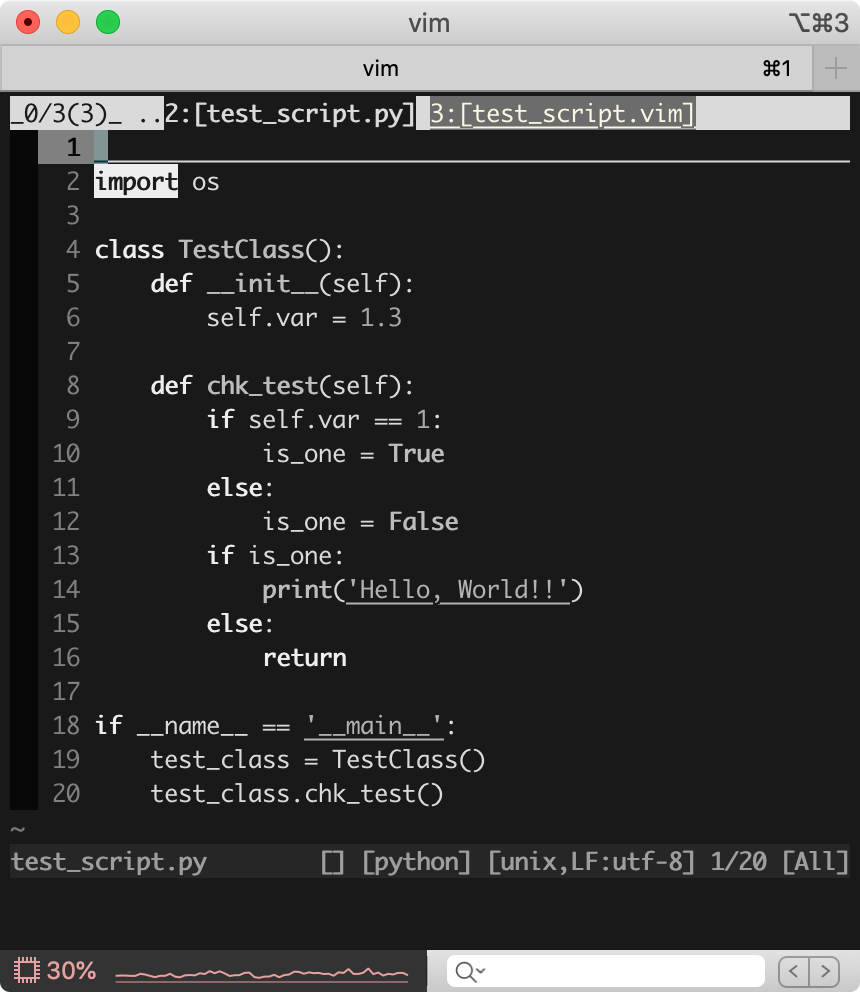
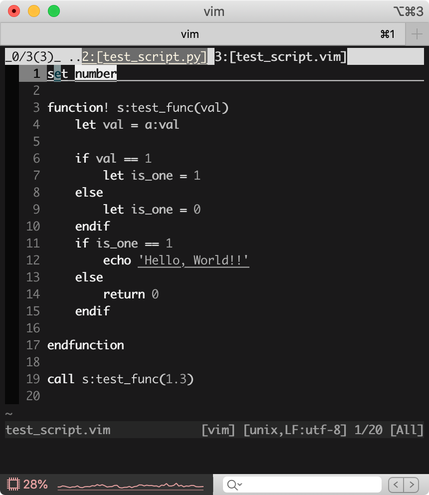
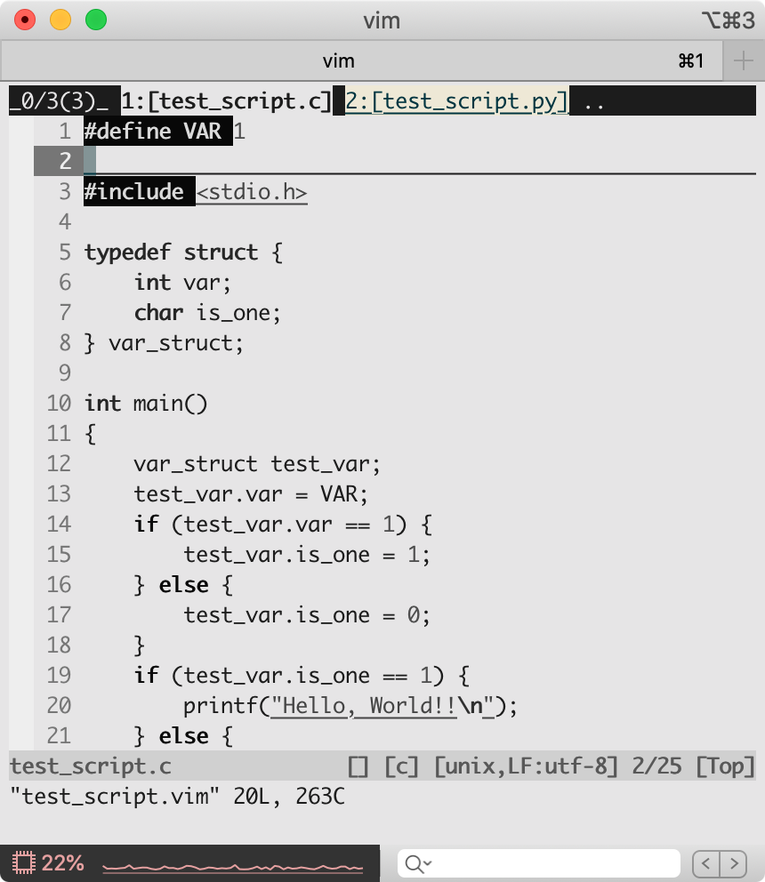

# vim colorscheme monoTone

Black and White vim colorscheme.

---

## screenshots

- Dark Scheme

c, python, vim script

  

- Light Scheme

c, python, vim script

  

## installation

- Dark Scheme

~~~
set background=dark
colorscheme monoTone
~~~

- Light Scheme

~~~
set background=light
colorscheme monoTone
~~~
